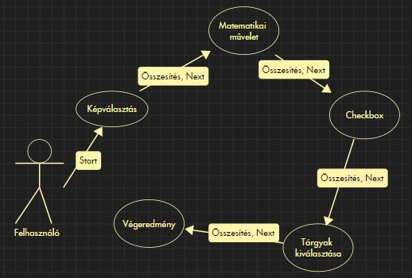

# Rendszerterv
## A rendszer célja,

## Projektterv
### Szerepkörök
- Designer: Csontos Dominik
- Developer: Palotai Martin
- Developer: Kóder László
- Developer: Sirák Norbert

### Egyéni Projekt Munkálatok
- Desing elkészítése: Csontos Dominik
- Keretrendszer elkészítése: Palotai Martin
- Matek művelet applikáció elkészítése: Kóder László
- Képválasztási applikáció elkészítése: Sirák Norbert
- Jelölőnégyzet applikáció: Csontos Dominik
- Nyomtatási művelet elkészítése: Palotai Martin
- Tárgyak megnevezése képről applikáció: Sirák Norbert

### Közös feladatok
- Követelmény Specifikáció megírásában történő közreműködés
- Funkcionális Specifikáció megírásában történő közreműködés
- Rendszerterv megírásában történő közreműködés

### Mérföldkövek
1. Keretrendszer elkészítése
2. Applikációk elkészítése
- Matek művelet applikáció elkészítése
- Képválasztási applikáció elkészítése
- Jelölőnégyzet applikáció
- Tárgyak megnevezése képről applikáció
- Nyomtatási művelet elkészítése
3. Desing elkészítése

## Üzleti folyamatok modellje

## Követelmények
### Funkcionális Követelmények
- Feladatok pontszámainak összesítése
- Feladatok kiértékelése
- Webes környezeten történő működés
- Teszt feladatok megfelelő futtatása
- Továbblépésként funkcionáló gomb működése
- Eredmények nyomtatásának megfelelő működése

### Nem Funkcionális Követelmények
- Látványos és egyedülálló dizájn
- Egyszerű, gyorsan értelmezhető, letisztult felhasználói felület
- Részfeladatok megfelelő megjelenítése

## Funkcionális terv
- Felhasználó: Képes lesz a teszt kitöltésére majd a kitöltés végén a teszt eredményének nyomtatására.

## Fizikai környezet
A teszt webes környezetben és minden böngészőben reszponzívnak készül el.
Nincsenek megvásárolt komponenseink.
Fejlesztői eszközök:
    Sublime text
    Visual studio code

## Architekturális terv

## Implementációs terv

## Tesztterv

## Telepítési terv

## Karbantartási terv